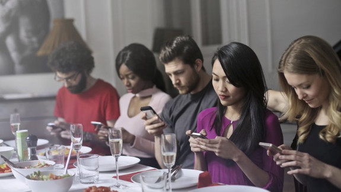

#The abolition of money
Mike, the boy's father, had already asked me yesterday how we got rid of the money. I just met him when I came to get the wood.  
  
"Hey Mike", I called to him, "if you want to come to me right away, then I can tell you the story of how we got rid of the money. I just have to bring that to the main fire for a short time."
Mike nodded in affirmative.
  
"Nice, that you are all here again. Yesterday I mentioned that we hardly needed any more money ourselves. In the beginning, we used the basic income to pay off the mortgage for the camp. But since we all got together and grew our own food, it was quickly paid off. "
  
"What is a mortgage?", one of the girls wants to know.
  
"A mortgage is a contract that you conclude with a bank. Suppose you buy a plot of land for 16.000,- €, but have hardly any money itself. Then you go to the bank and take out a mortgage. The bank draws the sum of 16.000,- € simply with a reservation in their computer and book, at the same time, this amount to your account. With this amount you can then pay the property. Until you have paid it off completely, however, the property still belongs to the bank. Now you have to pay an amount of 150,- € every month for 10 years to the bank and the property belongs to you. If you have counted, then you will notice, that you have paid 18.000,- € back, that is because that the banks want interest and fees from you."  
  
"What? They want to have money for something they once typed something in the computer? They did not even lend their own money.", grumbles one of the boys. 
  
"Well, that's how it was then, so we wanted to get rid of the money and the machinations of the banksters," I say.  
  
"When we paid off the property, we seldom needed money ourselves. Many other people followed our example and took their basic income to buy land and eventually became independent."   
  
"Hardly anyone needed loans or mortgages after that. Only the greedy people took out loans to produce some scrap that no-one needed. When they realized that they could not sell the stuff anymore, they gave up. At some point nobody used money any more, so the banks have all closed. "
  
"What I personally liked the most is the fact that hardly anyone went to work. All humans have taken care of themselves. And since hardly anyone has made money, hardly anyone has paid taxes. And as the taxpayers money ran out, the government stopped working. The entire national borders were no longer guarded. At some point there were no borders. Everybody was allowed to travel anywhere."   
  
Mike asks, "Tell me, what did you do if you wanted to buy a computer or a car?"
  
"Some things like computers and cars were not produced anymore, because we had enough of it on earth. Who needs new, faster computers every two years? Cars can be repaired, you do not always have to buy new ones. I lived in Denmark for a few years where the government levied 100% tax on introducing a new car. Since no cars were built in Denmark, the cars were repaired there. At that time there were a lot of fancy vintage cars around. "  
  
"As far as the computers are concerned, we have replaced the most important programs with the open source movement, so that the big software giant could no longer make profit with their software. This meant that no new hardware was developed further. So no new processors were developed. No one had to install a new version of the operating system just because the hardware had changed. That's why even computers that were 20 years old were still usable. The laws also prevented things being manufactured that would wear out after a short time", I add.
  
"So to answer your question, we did not buy new things anymore. And so the production of these things was almost completely discontinued", I say. "It even went so far that no oil was produced and the coal was left in the ground. "  
  
The oil and coal we owe to our children. They started striking on Fridays in 2018. Instead of going to school on Fridays, they went to the streets and protested against climate change. A year later, the adults also demonstrated. We have been on the streets for so long until the government has decided to immediately pass laws on alternative energy. Coal mining was banned from one day to the next and the petroleum we used for plastic and gasoline was given 300% penalty tax. Many drivers have been upset about it, but in the end they were all happy to be able to cycle through the cities without any cars. We replaced the plastic with hemp products. By the way, then also marijuana was legalized and alcohol has been prohibited ;-)  
  
"I've heard people still live in Berlin, is that right?", Mike asks.  
  
"Hehe, that's right", I answer. "There live a handful of people who run the museum there. The whole city was turned into a museum". 
  
"One can once again experience capitalism and communism at the same time.", I grin, "For example, there is still a subway operated there. It was converted to solar power and drives automatically without a driver. There are also shops where you can shop. At least that is simulated. And on the east side you can see the opposite. There are also shops there, only they have no colorful advertising as in the west. There, people lined up mannequins in a row in front of a shop that was supposed to be a queue of people who wanted to buy bananas. By the time the wall was still in place, bananas were so rare that, if they existed, people lined up in the queue in front of the shop for hours. But I find it really funny that this was also staged on the west side. Only there, instead of bananas, there was the "new" iPhone. ", I laugh.  
  
"What is iPhone?", a boy wants to know.  
  

"The iPhone was a so-called smartphone, actually a telephone. But for a phone it really had a lot of features. It was a complete computer with a screen that you could touch if you wanted to start a program."  

"The iPhone at that time was THE means of communication, you did not have to have any boring conversations with each other.", I joke.
  
"Fortunately, that does not exist anymore. I prefer to walk a few feet to someone to talk to.", Mike says.